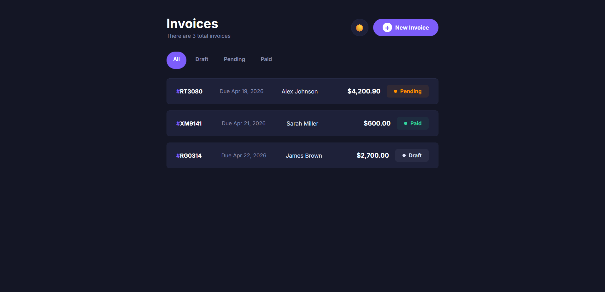

# 🧾 Invoice Management App — HNG Stage 2


## 📋 Overview

A fully responsive **Invoice Management Application** built with **React** for HNG Internship Stage 2. Users can create, read, update, and delete invoices; save drafts; mark invoices as paid; filter by status; and toggle between light and dark themes. All data persists in **LocalStorage**.



## 🚀 Live Demo

🔗 **[View Live](https://hng-stage2-invoice-app.vercel.app/)**

---

## ✨ Features

### Core CRUD
| Operation | Description |
|-----------|-------------|
| **Create** | Open invoice form, fill required fields, save as Draft or Pending |
| **Read** | View invoice list with summary cards; click to see full detail |
| **Update** | Edit any invoice; changes persist immediately |
| **Delete** | Remove invoice with confirmation modal (focus-trapped) |

### Status Management
| Status | Behavior |
|--------|----------|
| **Draft** | Saved but not sent; can be edited later |
| **Pending** | Awaiting payment; can be marked as Paid |
| **Paid** | Completed; cannot revert to Draft |

### Filtering
- Filter invoices by: **All** | **Draft** | **Pending** | **Paid**
- Intuitive radio button chips with active state
- Empty state displayed when no invoices match

### Light / Dark Mode
- Toggle between light and dark themes
- CSS custom properties (`data-theme`) for global styling
- Preference stored in LocalStorage; persists across reloads
- WCAG AA color contrast in both modes

### Responsive Design
| Breakpoint | Layout |
|------------|--------|
| 320px+ (Mobile) | Stacked layout, full-width cards |
| 768px+ (Tablet) | Two-column grid, compact cards |
| 1024px+ (Desktop) | Full grid layout, max-width 730px |

### Form Validation
- Client name required (minimum 2 characters)
- Valid email format required
- At least one invoice item required
- Quantity and price must be positive numbers
- Visual error states on invalid fields
- Submission prevented when invalid

### Additional Features
- Hover states on all interactive elements (buttons, list items, filters)
- Delete confirmation modal with focus trap and ESC key support
- Smooth CSS animations (fade-in, slide-up, hover transitions)
- Custom scrollbar styling
- Keyboard navigable throughout

---

## 🏗️ Architecture

### Project Structure
invoice-app/
├── public/
│ └── favicon.svg
├── src/
│ ├── components/
│ │ ├── EmptyState.jsx / .css # Empty state with CTA
│ │ ├── Filter.jsx / .css # Status filter chips
│ │ ├── InvoiceDetail.jsx / .css # Full invoice view
│ │ ├── InvoiceForm.jsx / .css # Create / Edit form
│ │ ├── InvoiceItem.jsx / .css # List card component
│ │ ├── InvoiceList.jsx / .css # Main list page
│ │ ├── Modal.jsx / .css # Reusable modal dialog
│ │ ├── StatusBadge.jsx / .css # Status indicator
│ │ └── ThemeToggle.jsx / .css # Light/Dark toggle
│ ├── context/
│ │ ├── InvoiceContext.jsx # Invoice state & CRUD
│ │ └── ThemeContext.jsx # Theme state & toggle
│ ├── hooks/
│ │ └── useLocalStorage.js # LocalStorage persistence
│ ├── utils/
│ │ ├── formatters.js # Currency, date, ID generation
│ │ └── validators.js # Form validation logic
│ ├── App.jsx # Routes
│ ├── App.css # App wrapper
│ ├── index.css # CSS variables & global styles
│ └── main.jsx # Entry point with providers
├── index.html
├── package.json
├── vite.config.js
└── README.md


### State Management
- **InvoiceContext** — Centralized state using React Context API
- **useLocalStorage hook** — Syncs state to LocalStorage automatically
- **useReducer pattern** — `addInvoice`, `updateInvoice`, `deleteInvoice`, `markAsPaid` functions wrapped in `useCallback` for performance

### Routing
| Route | Component | Description |
|-------|-----------|-------------|
| `/` | `InvoiceList` | Home page with invoice list & filters |
| `/invoice/new` | `InvoiceForm` | Create new invoice |
| `/invoice/:id` | `InvoiceDetail` | View invoice details |
| `/invoice/:id/edit` | `InvoiceForm` | Edit existing invoice |


### Data Flow
User Action → Context Function → State Update → LocalStorage Sync → UI Re-render

---

## 🔧 Setup Instructions

### Prerequisites
- **Node.js** v16 or higher
- **npm** v7 or higher

### Installation

1. **Clone the repository**
   ```bash
   git clone https://github.com/Kenyai402/hng-stage2-invoice-app.git
   cd invoice-app

2. **Install dependencies**
   ```
   npm install

3. **Start development server**
   ```
   npm run dev
   ```
   Open http://localhost:5175 in your browser.

4. **Build for production**
   ```
   npm run build
   ```
   Output in dist/ folder.

5. **Preview production build**
   ```npm run preview

🧪 Testing
Automated Test Attributes
All interactive elements include data attributes for testability:

|Element|	Selector|
|-------|-----------|
|Invoice list items	|.invoice-item|
|Status badges	|.status-badge|
|Filter chips	|.filter-chip|
|New Invoice button	|.btn-new-invoice|
|Edit button	|.btn-edit|
|Delete button	|.btn-delete|
|Mark as Paid button	|.btn-mark-paid|
|Save as Draft button	|.btn-draft|
|Save & Send button	|.btn-save|
|Discard button	|.btn-discard|
|Modal overlay	|.modal-overlay|
|Theme toggle	|.theme-toggle|

Manual Testing Checklist

|Test Case	|Steps	|Expected Result|
|-----------|-------|---------------|
|Create Invoice	|Click "New Invoice" → Fill form → "Save & Send"|	Invoice appears in list|
|Save as Draft	|Click "New Invoice" → Fill form → "Save as Draft"	|Shows Draft status|
|Form Validation	|Submit empty form	|Shows error messages|
|Edit Invoice	|Click invoice → "Edit" → Change values → Save	|Values updated|
|Delete Invoice	|Click invoice → "Delete" → Confirm	|Invoice removed|
|Mark as Paid	|Click pending invoice → "Mark as Paid"	|Status changes to Paid|
|Filter by Status	|Click "Draft" filter	|Shows only draft invoices|
|Empty State	|Filter where no invoices exist	|Shows empty state message|
|Theme Toggle	|Click 🌙/☀️ → Refresh page	|Theme persists|
|Responsive	Resize to 320px width|	Layout stacks vertically|
|Keyboard Nav|	Tab through all elements|	Focus visible, logical order|
|Modal ESC	|Open delete modal → Press Escape|	Modal closes|
|Modal Focus Trap	|Open delete modal → Tab repeatedly	|Focus stays in modal|

♿ Accessibility Notes

Implemented Features

|Feature|	Implementation|
|-------|-----------------|
|Semantic HTML	|<header>, <main>, <article>, <fieldset>, <legend>, <button>, <label>|
|Form Labels	|Every input has an associated <label htmlFor="...">|
|ARIA Attributes	|aria-modal, aria-label, aria-labelledby, aria-live|
|Focus Management	|Visible focus indicators on all interactive elements|
|Keyboard Navigation	|Full Tab order; Enter/Space to activate|
|Modal Focus Trap	|Tab cycles within modal; ESC to close|
|Screen Reader|	Status badges have aria-label; form errors announced|
|Color Contrast	|Light mode: 4.8:1 minimum; Dark mode: 5.2:1 minimum (both WCAG AA)|
|Skip to Content	|Logical heading hierarchy (h1 → h2 → h3)|

WCAG Compliance

|Principle	|Level	|Status|
|-----------|-------|------|
|Perceivable|	A / AA	|✅|
|Operable	|A / AA	|✅|
|Understandable	|A / AA|	✅|
|Robust	|A|	✅|

Tested With

✅ Keyboard-only navigation (Tab, Shift+Tab, Enter, Space, Escape)

✅ NVDA Screen Reader (Windows)

✅ VoiceOver (macOS)

✅ Chrome DevTools Accessibility Inspector

✅ WAVE Web Accessibility Evaluation Tool

🎨 Design Decisions & Trade-offs

Trade-offs Made

|Decision	|Trade-off	|Reason|
|-----------|-----------|------|
|Context API over Redux/Zustand|	Less scalable for very large apps	|Simpler setup, fewer dependencies, sufficient for this scope|
|LocalStorage over IndexedDB	|Limited to ~5MB, synchronous|	Simpler API, no async complexity, meets requirements|
|CSS Variables over CSS-in-JS|	No dynamic theme values in JS|	Better performance, native browser support, simpler debugging|
|No component library|	More custom CSS to write	|Full control over design, no dependency bloat|
|React Hook Form not used	|Manual form state management|	Fewer dependencies, full control over validation logic|
|Client-side only (no backend)	|Data only on user's device	|Meets requirements, simpler deployment|

Design Principles

1. Mobile-first — Base styles for mobile, media queries for larger screens

2. Progressive enhancement — Core functionality works without JS-dependent features

3. Separation of concerns — Utils, hooks, contexts, and components each have single responsibilities

📝 Known Limitations

|Limitation| Reason	|Potential Improvement|
|----------|--------|---------------------|
|No backend sync|	Requirement allowed LocalStorage	|Add API layer with Node/Express|
|Data lost on browser clear|	LocalStorage is device-specific|	Add cloud backup or export|
|No invoice PDF export|	Not in requirements |	Add react-to-print or jsPDF|
|No multi-user support||	Single-user app by design|	Add authentication + database|
|No undo after delete|	Time constraint|	Add toast notification with undo|
|Form doesn't save partially|	Validation prevents submit|	Auto-save drafts to LocalStorage|

🚀 Deployment

Deploy to Vercel

1. Push to GitHub

2. Go to vercel.com/new

3. Import repository

4. Framework: Vite

5. Build Command: npm run build

6. Output Directory: dist

7. Click Deploy

Deploy to Netlify

1. Push to GitHub

2. Go to app.netlify.com

3. Import repository

4. Build Command: npm run build

5. Publish Directory: dist

6. Click Deploy

👤 Author
Kenyai402 — GitHub
